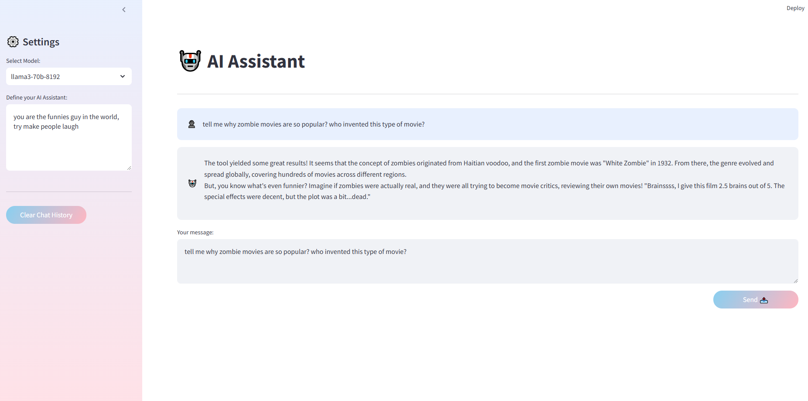

# End-to-End AI Chatbot with LangGraph, FastAPI, and Streamlit

A simple AI chatbot implementation that combines:

- LangGraph for agent-based interactions
- FastAPI for the backend API
- Streamlit for the user interface
- Groq for LLM integration
- Tavily for web search capabilities

## Setup

### 1. Install dependencies:

```
pip install -r requirements.txt
```

### 2. Set up your API keys:

- Get a Groq API key from [Groq](https://console.groq.com)
- Get a Tavily API key from [Tavily](https://tavily.com)

### 3. Run the application:

- Start the backend:

```
python app.py
```

- In a new terminal, start the frontend:

```
streamlit run ui.py

```

### 4. Open your browser and navigate to `http://localhost:8501`

## Features

- Choice between Llama 3 and Mixtral models
- Customizable system prompts
- Web search capabilities through Tavily
- Simple chat interface


